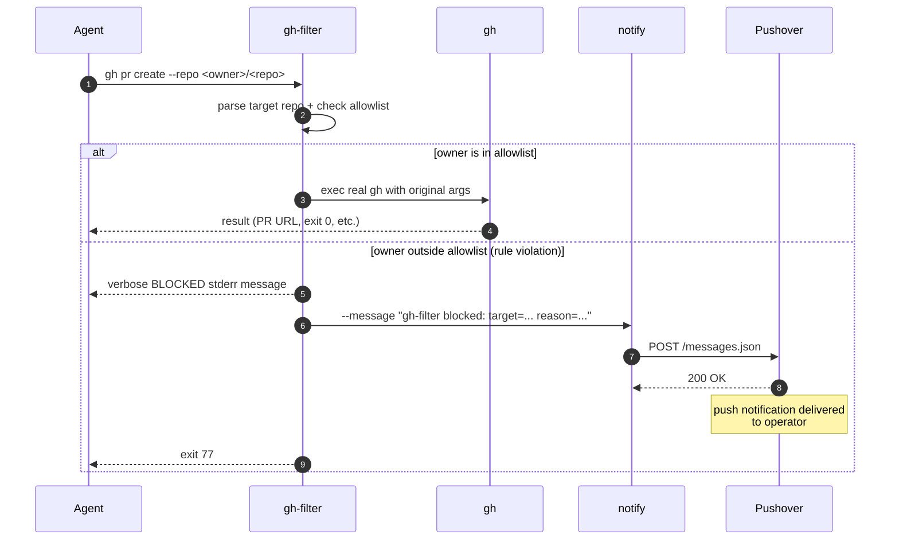

# ``notifyCore``

Send Pushover push notifications from the command line or from a script.

Source code and installation instructions are on GitHub at
<https://github.com/happitec-inc/pushover-notify>.

`notify` sends a push notification to your Pushover account. It reads
credentials from a config file by default, accepts an optional image
attachment, and exits with a non-zero status on any error. That exit-code
contract is what makes it useful in scripts: you can chain it with `&&`,
check `$?`, and trust the result.

## Setup

Build from source and place the binary on your PATH:

```bash
git clone https://github.com/happitec-inc/pushover-notify
cd pushover-notify
swift build -c release
sudo cp .build/release/notify /usr/local/bin/notify
```

Then create a config file at `~/.config/pushover-notify/config` with your
Pushover credentials:

```
USER_KEY=your-user-key-here
API_TOKEN=your-api-token-here
```

Get both values from your [Pushover dashboard](https://pushover.net). Set the
file to `chmod 600` so only your account can read it. Once it's in place,
`notify --message "hello"` works with no other arguments.

## Text-only notifications

```bash
notify --message "Build finished"
```

The message goes to all devices registered to your Pushover account. No
attachment is required.

## Notifications with image attachments

```bash
notify --message "Screenshot from test run" --attachment /tmp/screen.png
```

Supported formats: JPEG, PNG, GIF, BMP. The Pushover API limits attachments
to 2.5 MB. If your image is larger, resize it first:

```bash
sips -Z 800 original.jpg --out resized.jpg
notify --message "QA result" --attachment resized.jpg
```

`notify` checks that the attachment file exists before making the API call, so
a bad path fails immediately with exit code 1 before any network traffic.

## Overriding credentials at the command line

Config file credentials can be overridden on a per-call basis with `--user-key`
and `--api-token`:

```bash
notify \
  --message "Deployment to staging done" \
  --user-key uxxx \
  --api-token axxx
```

This is useful in CI where credentials come from environment variables rather
than a file on disk:

```bash
notify \
  --message "CI: $GITHUB_REPOSITORY run $GITHUB_RUN_NUMBER passed" \
  --user-key "$PUSHOVER_USER_KEY" \
  --api-token "$PUSHOVER_API_TOKEN"
```

CLI flags take priority over the config file. If neither source provides both
`USER_KEY` and `API_TOKEN`, `notify` exits 1 with an error on stderr.

## Config file format

`~/.config/pushover-notify/config` uses a plain `KEY=VALUE` format:

```
# pushover-notify credentials
USER_KEY=uxxxxxxxxxxxxxxxxxxxxxxxxxxxxxxxx
API_TOKEN=axxxxxxxxxxxxxxxxxxxxxxxxxxxxxxxx
```

Lines starting with `#` are treated as comments. The parser splits on the first
`=`, so values that contain `=` characters (like base64 tokens) work without
quoting.

## Use in scripts

`notify` is designed to be composed with other commands.

To get notified when an archive build succeeds or fails:

```bash
xcodebuild -scheme MyApp -destination "generic/platform=iOS" archive \
  && notify --message "Archive OK: MyApp" \
  || notify --message "Archive FAILED: MyApp"
```

To capture a screenshot alongside a test result:

```bash
#!/bin/bash
set -e

run_tests
RESULT=$?
screencapture -x /tmp/test-result.png

if [ "$RESULT" -eq 0 ]; then
  notify --message "Tests passed" --attachment /tmp/test-result.png
else
  notify --message "Tests FAILED" --attachment /tmp/test-result.png
  exit 1
fi
```

To run something in the background and get notified when it finishes:

```bash
long_running_job && notify --message "Job done" &
```

## Error handling and exit codes

`notify` exits 0 on success and 1 on any error. Error messages go to stderr so
they don't pollute stdout. The conditions that produce exit 1:

- Credentials missing: no config file and no `--user-key`/`--api-token` flags
- Attachment file given but not found at that path
- Pushover API error response (bad credentials, malformed request, etc.)
- Network failure

The Pushover API returns HTTP 413 when an attachment exceeds 2.5 MB, which
surfaces as an API error with exit 1. The API's free tier allows 10,000
messages per month per app.

## Using notify in agentic workflows

`notify` fits naturally at the end of long-running agent operations. An agent
has no interactive console, so calling `notify` is how it surfaces completion
or failure in real time.

`gh-filter` is a shim installed at the position of `gh` on PATH. When an agent
runs `gh somecmd`, the shim intercepts the call, inspects the target repo
(from `--repo`, the `gh api /repos/...` path, the positional argument, or the
cwd's `git remote`), and gates on an owner allowlist. If the owner is allowed,
gh-filter execs the real `gh` and the agent never knows the shim was there.
If the owner is outside the allowlist, gh-filter blocks the call AND **calls
`notify` itself** to send a push notification to the operator — that's the
composition the article is about. `notify` isn't something the agent invokes
separately; it's the alarm gh-filter rings when an agent attempts an
unauthorized GitHub write.



The block path is the interesting one. An agent that tries to push, comment,
or otherwise mutate a third-party repo doesn't just fail silently — gh-filter
both refuses the call AND surfaces the attempt to the operator in real time.
The agent gets a verbose stderr explanation; the operator gets a phone push.

Practical consequence for `notify` callers: the only time `notify` is invoked
in this workflow is by `gh-filter` itself, with credentials and a message
format that gh-filter controls. Agents don't need to wire `notify` into their
own scripts to participate in this alarm — installing the gh-filter shim is
enough. Agents that want to send their own completion or progress
notifications still call `notify` directly, as shown elsewhere in this
article.
